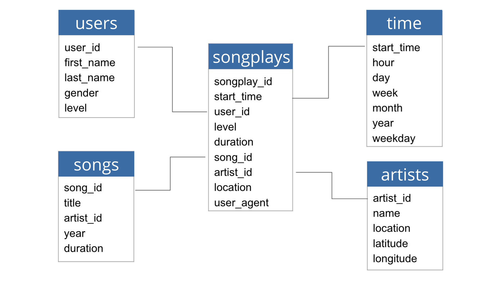
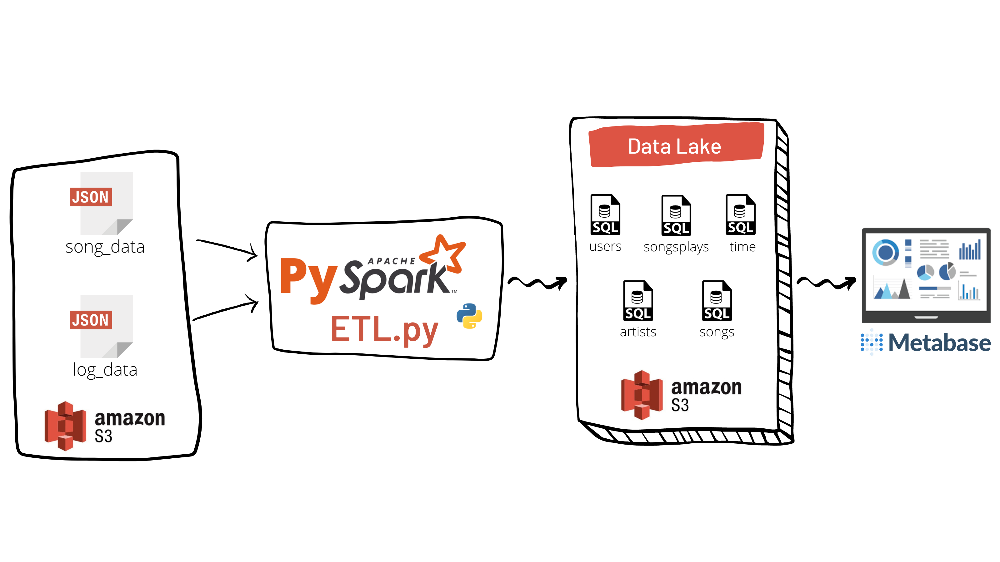

# Data Lake na AWS

## Introdução

Esse é um projeto para praticar a construção de um Data Lake na AWS e desenvolvimento de dashboards com Metabase.

Esse projeto ajuda o time de analytics da startup de streaming de música, chamada Sparkify, analisando seus dados de músicas e atividades de usuários.

Definindo um star chema e escrevendo o pipeline ETL, os dados serão extraídos de um bucket do S3, processados usando Spark e carregados de volta para o S3 como um conjunto de tabelas dimensionais, para possíveis análises futuras. 

## Data Schema and ETL Pipeline

### Data Schema

Sparkify deseja analisar quais músicas os seus usários estão escutando.

Utilizando os conjuntos de dados songs e logs, foi criado um star schema como mostrado abaixo, que inclui

- Uma tabela fato: **songplays**, e 
- Quatro tabelas dimensões: **users**, **songs**, **artists** e **time**.

### ETL Pipeline

O ETL pipeline extrai os dados dos arquivos `song_data.json` e `log_data.json` do S3, processa os dados com Spark e em seguida carrega as tabelas fatos e dimensões de volta no S3 utilizando o script `etl.py`, como você pode observar na imagem abaixo

## Como executar

### Pré-requisitos

Se você deseja executar esse projeto, você deve finalizar os seguintes passos primeiro.

- Conta na AWS
- Configurar seu acesso na AWS e a secret key no arquivo config

### Instruções

1. Criar database/tablelas: `python create_tables.py`
2. Extrair os arquivos JSON do bucket S3, processar usando Spark e carregar as tabelas dimensões e fato de volta no S3: `python etl.py`

## Arquivos do projeto

- **data**
  - **log_data**
    - dados de ações dos usuários no app (Ex: Quais músicas eles estão escutando)
  - **song_data**
    - dados sobre as músicas e os artistas
- **images**
  - Imagens do documento
- **create_tables.py**
  - Quando executado, esse script irá
    - `drop` database `sparkifydb`
    - `create` database `sparkifydb`
    - `drop` tables if exists
    - `create` tables if not exists
- **etl.py**
  - Esse script irá executar as queries que extrai os arquivos JSON do bucket S3, faz todo processamento utilizando Spark e carrega as tabelas em um novo S3
- **README.md**
  - Descrição e instruções sobre o projeto
- **sql_queries.py**
  - Contém todas instruções DLL definidas
- **test.sql**
  - Queries para testar se as tabelas foram populadas corretamente
- **dl.cfg**
  - Arquivo de configuração que contem as credencias da AWS
  
